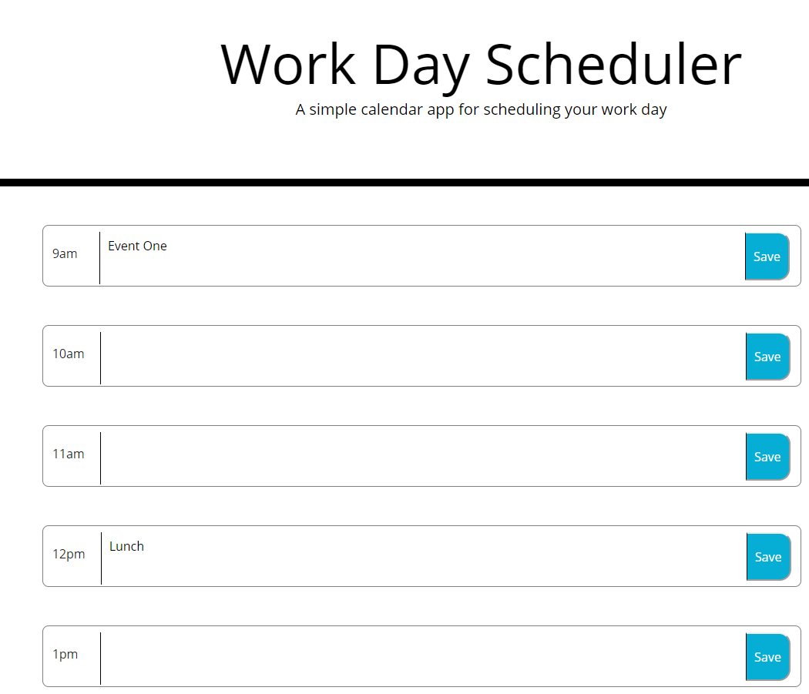
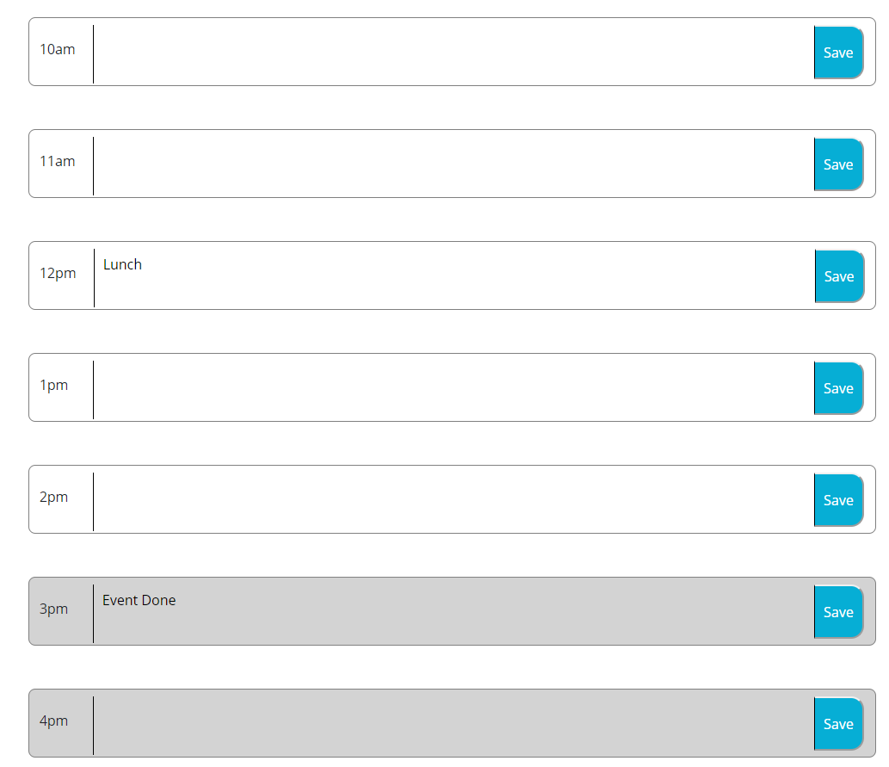

## Day Planner

Goals : Create a layout that will store event's and stay upon refreshing. For each time block, color's should change according to current time.

Description : The following shows a time frame from 9 am to 6 pm. Each time block has a save button and a text area to input events. Type in event and save to store values inputted. 

Each time block will change colors according to the following:

Present = Red;
Future = Green;
Past 6 Hours = Grey;
Hours for next day = White;

example 1

Example 2 
